# Universal DevOps Pipeline

A reusable DevOps pipeline that can be applied to any project (Java Spring Boot, React, Node.js, etc.).

## 🚀 Quick Start

### 1. Setup Pipeline for Your Project
```bash
python3 setup.py /path/to/your/project <app-type> <project-name>
```

**Supported app types:**
- `java-spring-boot` - For Spring Boot applications
- `node-backend` - For Node.js backend applications

**Example:**
```bash
# For Java backend
python3 setup.py ../MyApp java-spring-boot myapp-backend

# For Node.js backend  
python3 setup.py ../MyNodeApp node-backend myapp-node-backend
```

### 2. What Gets Created
```
your-project/
├── devops/
│   ├── terraform/          # Infrastructure as code (ECS Fargate)
│   ├── ecs/               # ECS task definitions
│   └── scripts/          # Deployment scripts
├── Dockerfile            # Container definition
└── .github/workflows/   # GitHub Actions
```

## 🏗️ Architecture Overview

```mermaid
flowchart TD
    %% Developer Section
    DEV[👨‍💻 Developer<br/>Code Changes] --> GIT[📤 Git Push]
    
    %% CI/CD Pipeline
    GIT --> BUILD[🔨 Build<br/>Maven/npm]
    BUILD --> TEST[🧪 Test<br/>JUnit/Jest]
    TEST --> DOCKER[🐳 Docker Build<br/>Container Image]
    DOCKER --> APPROVAL{🔐 Manual Approval<br/>Production Gate}
    
    %% Infrastructure Layer
    APPROVAL -->|Approved| ECR[📦 Amazon ECR<br/>Container Registry]
    ECR --> TERRAFORM[🏗️ Terraform<br/>Infrastructure as Code]
    
    %% AWS Infrastructure
    TERRAFORM --> VPC[🌐 AWS VPC<br/>Network Isolation]
    VPC --> ALB[⚖️ Application<br/>Load Balancer]
    VPC --> ECS[🐳 ECS Fargate<br/>Serverless Containers]
    VPC --> RDS[🗄️ RDS Database<br/>PostgreSQL/MySQL]
    
    %% ECS Deployment
    TERRAFORM --> ECS_SERVICE[⚙️ ECS Service<br/>Container Orchestration]
    ECS_SERVICE --> CLOUDWATCH[📊 CloudWatch<br/>Monitoring]
    ECS_SERVICE --> PARAMS[🔑 Parameter Store<br/>Secrets Management]
    ECS_SERVICE --> SECURITY[🛡️ Security Groups<br/>Network Rules]
    
    %% Deployment Flow
    ECS_SERVICE --> DEPLOY[🚀 Application<br/>Deployment]
    DEPLOY --> HEALTH[❤️ Health Check<br/>Validation]
    HEALTH --> ROLLBACK[🔄 Rollback<br/>Manual Trigger]
    
    %% Styling
    classDef devOps fill:#e1f5fe,stroke:#01579b,stroke-width:2px
    classDef aws fill:#fff3e0,stroke:#e65100,stroke-width:2px
    classDef cicd fill:#f3e5f5,stroke:#4a148c,stroke-width:2px
    classDef security fill:#e8f5e8,stroke:#1b5e20,stroke-width:2px
    
    class DEV,GIT devOps
    class BUILD,TEST,DOCKER,APPROVAL cicd
    class ECR,VPC,ALB,ECS,RDS,S3,CLOUDWATCH,PARAMS aws
    class TERRAFORM,ECS_SERVICE,DEPLOY,HEALTH,ROLLBACK devOps
    class SECURITY security
```



### 🔄 Deployment Flow Diagram

```mermaid
sequenceDiagram
    participant Dev as 👨‍💻 Developer
    participant GH as 🐙 GitHub Actions
    participant ECR as 📦 Amazon ECR
    participant TF as 🏗️ Terraform
    participant ECS as 🐳 ECS Fargate
    participant AWS as ☁️ AWS Infrastructure
    participant APP as 🚀 Application
    
    Dev->>GH: git push
    GH->>GH: Build & Test
    GH->>ECR: Push Docker Image
    GH->>GH: Wait for Approval
    Note over GH: Manual Production Gate
    GH->>TF: Apply Infrastructure
    TF->>AWS: Create/Update Resources
    AWS-->>TF: Resources Ready
    GH->>ECS: Update ECS Service
    ECS->>ECR: Pull Docker Image
    ECS->>AWS: Deploy to Fargate Tasks
    AWS->>APP: Start Application
    APP-->>ECS: Health Check Response
    ECS-->>GH: Deployment Complete
    
    Note over Dev,APP: Zero-downtime deployment with rollback capability
```



### 🛠️ Technology Stack


**CI/CD & Version Control:**
- GitHub Actions (Workflow automation)
- Git (Version control)

**Infrastructure as Code:**
- Terraform (AWS resource provisioning)
- ECS Fargate (Serverless container orchestration)

**Containerization:**
- Docker (Application containerization)
- Amazon ECR (Container registry)

**AWS Services:**
- ECS Fargate (Serverless containers)
- VPC (Network isolation)
- Application Load Balancer (Traffic distribution)
- Auto Scaling (Container-level scaling)
- RDS (Managed databases)
- CloudWatch (Monitoring & logging)
- Parameter Store (Secrets management)
- Security Groups (Network security)

**Application Support:**
- Java Spring Boot (Maven, JUnit) → ECS Fargate
- Node.js Backend (npm, Jest) → ECS Fargate

## 📋 Step-by-Step Pipeline Flow

### Phase 1: Developer Workflow
**1. Code Development**
- Developer writes code and commits changes
- Code is pushed to GitHub repository
- Triggers GitHub Actions workflow automatically

### Phase 2: CI/CD Pipeline (GitHub Actions)
**2. Build Stage**
- Downloads source code from repository
- Installs dependencies (Maven for Java, npm for React/Node.js)
- Compiles application code
- Creates build artifacts

**3. Test Stage**
- Runs unit tests (JUnit for Java, Jest for React/Node.js)
- Generates test reports and coverage
- Fails pipeline if tests don't pass
- Ensures code quality before deployment

**4. Docker Build**
- Creates Docker image from application
- Tags image with commit SHA and version
- Optimizes image size and security
- Prepares for containerized deployment

**5. Manual Approval Gate**
- Pipeline pauses for production deployments
- Requires manual approval from authorized team member
- Prevents accidental production releases
- Allows final review before infrastructure changes

### Phase 3: Infrastructure Provisioning
**6. Container Registry (ECR)**
- Pushes Docker image to Amazon ECR
- Stores images securely with encryption
- Manages image versions and lifecycle
- Provides secure access for deployment

**7. Terraform Infrastructure**
- Reads infrastructure configuration files
- Creates/updates AWS resources:
  - VPC with public subnets
  - Application Load Balancer for traffic distribution
  - ECS Cluster and Fargate Services
  - RDS database (PostgreSQL/MySQL)
  - Security Groups for network access
  - CloudWatch for monitoring
  - Parameter Store for secrets

### Phase 4: Application Deployment
**8. ECS Service Update**
- Updates ECS task definition with new image
- ECS automatically pulls Docker image from ECR
- Performs rolling deployment to Fargate tasks
- Maintains zero downtime during updates

**9. Container Orchestration**
- ECS manages container lifecycle automatically
- Load balancer routes traffic to healthy tasks
- Auto-scaling adjusts task count based on demand
- No server management required

**10. Health Validation**
- Performs application health checks
- Validates database connectivity
- Confirms all services are running
- Monitors application metrics

### Phase 5: Post-Deployment
**11. Monitoring Setup**
- CloudWatch collects application logs
- Metrics dashboards become available
- Alerts configured for critical issues
- Performance monitoring activated

**12. Rollback Capability**
- Manual rollback available if issues detected
- Can revert to previous application version
- Infrastructure rollback for critical problems
- Database rollback with backup restoration

### 🔄 Continuous Operation
- **Auto Scaling**: ECS tasks scale based on traffic
- **Health Monitoring**: Automatic replacement of unhealthy tasks
- **Security Updates**: Automatic with new container deployments
- **Backup Management**: Automated database backups

## 🚨 Failure Handling
- **Build Failures**: Pipeline stops, notifications sent to team
- **Test Failures**: Deployment blocked until tests pass
- **Infrastructure Issues**: Terraform rollback, manual intervention
- **Deployment Problems**: Automatic health check failures trigger alerts
- **Manual Rollback**: One-click rollback to previous stable version

## 📖 Documentation
- [Complete Beginner Guide](docs/BEGINNER_GUIDE.md) - Step-by-step setup
- [Advanced Configuration](docs/ADVANCED.md) - Customization options

## 🎯 Features
- ✅ Multi-environment support (staging/production)
- ✅ Auto-scaling infrastructure
- ✅ Zero-downtime deployments
- ✅ Health checks and monitoring
- ✅ Easy rollback
- ✅ Security best practices

## 🔧 Requirements
- AWS Account
- GitHub Account
- Terraform installed
- Docker installed
- AWS CLI configured

## 🌟 Benefits of Reusable Pipeline
1. **Consistency** - Same deployment process across all projects
2. **Time Saving** - No need to recreate DevOps setup for each project
3. **Best Practices** - Built-in security and reliability features
4. **Easy Updates** - Update pipeline once, apply to all projects
5. **Team Collaboration** - Standardized process for entire team