# Universal DevOps Pipeline

A reusable DevOps pipeline that can be applied to any project (Java Spring Boot, React, Node.js, etc.).

## 🚀 Quick Start

### 1. Setup Pipeline for Your Project
```bash
python3 setup.py /path/to/your/project <app-type> <project-name>
```

**Supported app types:**
- `java-spring-boot` - For Spring Boot applications
- `react-frontend` - For React applications  
- `node-backend` - For Node.js applications

**Example:**
```bash
# For backend
python3 setup.py ../MyApp java-spring-boot myapp-backend

# For frontend  
python3 setup.py ../MyAppFrontend react-frontend myapp-frontend
```

### 2. What Gets Created
```
your-project/
├── devops/
│   ├── terraform/          # Infrastructure as code
│   ├── ansible/           # Deployment automation
│   ├── docker/           # Container configuration
│   └── scripts/          # Deployment scripts
├── Dockerfile            # Container definition
├── Jenkinsfile          # CI/CD pipeline
└── .github/workflows/   # GitHub Actions
```

## 🏗️ Architecture Overview


### 🔄 Deployment Flow Diagram

```mermaid
sequenceDiagram
    participant Dev as 👨‍💻 Developer
    participant GH as 🐙 GitHub Actions
    participant ECR as 📦 Amazon ECR
    participant TF as 🏗️ Terraform
    participant ANS as ⚙️ Ansible
    participant AWS as ☁️ AWS Infrastructure
    participant APP as 🚀 Application
    
    Dev->>GH: git push
    GH->>GH: Build & Test
    GH->>ECR: Push Docker Image
    GH->>GH: Wait for Approval
    Note over GH: Manual Production Gate
    GH->>TF: Apply Infrastructure
    TF->>AWS: Create/Update Resources
    AWS-->>TF: Resources Ready
    TF->>ANS: Trigger Deployment
    ANS->>ECR: Pull Docker Image
    ANS->>AWS: Deploy to EC2 Instances
    AWS->>APP: Start Application
    APP-->>ANS: Health Check Response
    ANS-->>GH: Deployment Complete
    
    Note over Dev,APP: Zero-downtime deployment with rollback capability
```



### 🛠️ Technology Stack


**CI/CD & Version Control:**
- GitHub Actions (Workflow automation)
- Git (Version control)

**Infrastructure as Code:**
- Terraform (AWS resource provisioning)
- Ansible (Configuration management)

**Containerization:**
- Docker (Application containerization)
- Amazon ECR (Container registry)

**AWS Services:**
- EC2 (Compute instances)
- VPC (Network isolation)
- Application Load Balancer (Traffic distribution)
- Auto Scaling Groups (Dynamic scaling)
- RDS (Managed databases)
- CloudWatch (Monitoring & logging)
- Parameter Store (Secrets management)
- Security Groups (Network security)

**Application Support:**
- Java Spring Boot (Maven, JUnit)
- React (npm, Jest)
- Node.js (npm, Jest)

## 📖 Documentation
- [Complete Beginner Guide](docs/BEGINNER_GUIDE.md) - Step-by-step setup
- [Advanced Configuration](docs/ADVANCED.md) - Customization options

## 🎯 Features
- ✅ Multi-environment support (staging/production)
- ✅ Auto-scaling infrastructure
- ✅ Zero-downtime deployments
- ✅ Health checks and monitoring
- ✅ Easy rollback
- ✅ Security best practices

## 🔧 Requirements
- AWS Account
- GitHub Account
- Terraform installed
- Ansible installed
- Docker installed

## 🌟 Benefits of Reusable Pipeline
1. **Consistency** - Same deployment process across all projects
2. **Time Saving** - No need to recreate DevOps setup for each project
3. **Best Practices** - Built-in security and reliability features
4. **Easy Updates** - Update pipeline once, apply to all projects
5. **Team Collaboration** - Standardized process for entire team